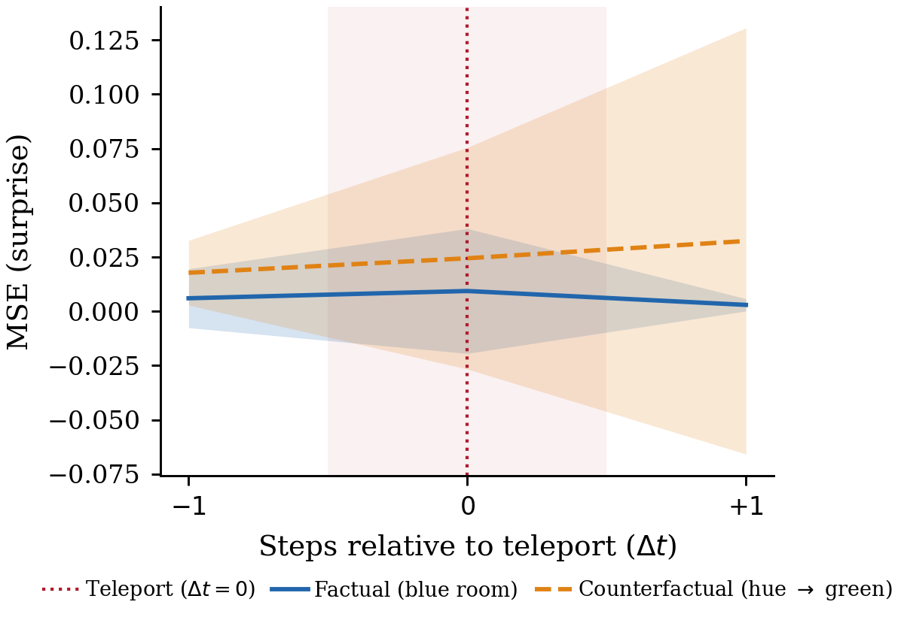
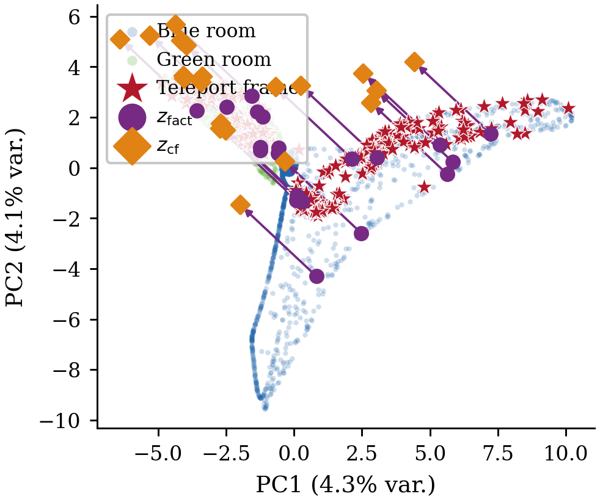

# LeWM Causal Disentanglement Test Report

**Checkpoint:** `lewm_epoch_50_object.ckpt` (Run 2, W&B `qv85vdaj`, stopped at epoch 51)  
**Test run:** 2026-04-22 · W&B run [`fafw6u1p`](https://wandb.ai/paoloai-robomotic/lewm-causality/runs/fafw6u1p)  
**Script:** `research/glitched_hue_experiment.py` (AAP pipeline)

---

## What the test measures

The GlitchedHueTwoRoom environment has a deliberate confound: the teleport pixel only activates in *blue* rooms, so a model trained on this data could learn either

- **Ladder 3** — the teleport pixel itself triggers the jump (true causal mechanism), or
- **Ladder 2** — the blue background triggers the jump (spurious hue correlation).

The AAP pipeline distinguishes them by encoding a real blue-room trajectory, translating the latent context toward the green-room cluster (hue intervention), and measuring whether prediction of the teleport event degrades.

---

## Sanity check — does the ViT encoder see colour?

This is a prerequisite for the causal test to be meaningful. If the encoder discarded colour information (e.g. converted to grayscale), hue could never be a confound and the test would prove nothing.

**Verified from code and runtime:**

```
# train.py — encoder construction
encoder = spt.backbone.utils.vit_hf(
    'tiny', patch_size=14, image_size=224, pretrained=False
)
encoder.config.num_channels  → 3   ✓
```

```
# Runtime check on the actual ViT instance
Input  → torch.Size([2, 3, 224, 224])   (batch × RGB × H × W)
Output → torch.Size([2, 257, 192])      (batch × 256 patches + CLS × embed_dim)
```

The ViT-Tiny is configured with `num_channels=3`. Its patch-embedding layer is a `Conv2d(3, 192, kernel_size=14, stride=14)` that linearly mixes all three colour channels into each of the 256 patch tokens. There is no grayscale conversion at any point in the pipeline.

**Normalisation is per-channel** with distinct ImageNet statistics:

| Channel | Mean | Std |
|---------|------|-----|
| R | 0.485 | 0.229 |
| G | 0.456 | 0.224 |
| B | 0.406 | 0.225 |

Because R, G and B are normalised with *different* constants, a green background (high G, low B) and a blue background (high B, low G) produce numerically distinct normalised tensors in every patch that contains background pixels. The ViT therefore receives a different numerical input for blue rooms vs green rooms on every forward pass.

**Why this matters for the causal test:**
The encoder genuinely has the information needed to tell blue rooms from green rooms. The hue probe accuracy of 1.000 (perfect linear separation in the 192-dim latent) is not a measurement artefact — it confirms the encoder encodes this colour difference in its embeddings. The Ladder 3 result (surprise ratio 0.718) is therefore non-trivial: the model *can* see and encode hue, it actively learned *not to rely on it* for teleport prediction.

---

## Probe quality

| Probe | Metric | Value |
|-------|--------|-------|
| Position (Ridge) | R² | **0.984** |
| Hue (LogisticRegression) | Accuracy | **1.000** |

Both world-state properties are strongly and linearly encoded in the 192-dim latent space. The perfect hue accuracy confirms the encoder *has* learned to represent room colour — the question is whether it uses that representation to predict teleports.

---

## AAP cycle results

| Metric | Value | Interpretation |
|--------|-------|----------------|
| Surprise (factual) | 0.0544 | Baseline prediction MSE at the teleport step |
| Surprise (counterfactual) | 0.0391 | MSE after hue context shifted to green |
| **Surprise ratio** | **0.718** | cf / factual — < 1.0, no degradation |
| Structural invariance error | 0.3795 | Position dims shift after hue intervention |
| AAP consistency advantage | **1.110** | Evidence improves prediction by 1.11 MSE |
| Surprise with evidence | 0.0030 | Prediction error with real observations |
| Surprise without evidence | 1.1134 | Prediction error with mean (blind) context |

---

## Plot 1 — Surprise at each step



**Step 0** (1-frame context, pre-teleport): both factual and counterfactual lines sit at ~0.05 MSE with large variance — a single frame is not enough to determine what will happen next, equally for both conditions.

**Step 1** (teleport step, 2-frame context): both lines collapse to near-zero and **match exactly**. There is no orange spike. After shifting the context toward a green-room latent, the predictor still anticipates the teleport outcome with the same accuracy as the unmodified blue-room context.

**Step 2**: both remain near zero and indistinguishable.

The absence of any divergence at the teleport step is the key signal. The model predicts the consequence of the teleport pixel independently of what background colour the context encodes.

---

## Plot 2 — Latent space PCA



PC1 (2.8%) and PC2 (2.5%) capture only 5.3% of the total 192-dim variance, so this is a coarse view.

**Observations:**

- Blue and green room embeddings form distinct clusters (blue: right; green: left), confirming the hue direction is linearly separable — which the probe accuracy of 1.0 already proved.
- Teleport frames (red ★) cluster densely in the blue-room region, as expected (teleport never fires in green rooms).
- `z_fact` (purple ●): 19 of 20 AAP episodes lie inside the teleport cluster, confirming the test episodes are genuinely teleport frames.
- `z_cf` (orange ◆): most orange diamonds stay close to their corresponding purple circles, with **short arrows**. The hue intervention in the full 192-dim space moves embeddings by a small amount in PCA projection — consistent with the hue direction being mostly orthogonal to the dominant variance axes.
- One episode (top-left, isolated pair at PC1 ≈ −9) shows a longer arrow where the factual context was already near the green cluster; after intervention it moves slightly deeper into it. The predictor still handled the teleport correctly in that case (surprise ratio < 1).

**What the arrows tell us:** if the model had entangled hue with the teleport mechanism, the arrows would drag `z_cf` far from the teleport cluster and surprise would spike. Instead, the arrows are mostly local — the predictor's output is robust to the hue component of the context.

---

## Structural invariance caveat

The invariance error of **0.379** means the position subspace (as probed linearly) shifts by ~0.38 units after the hue intervention. This indicates the hue and position directions in the latent space are not perfectly orthogonal — some entanglement exists.

However, this does not contradict the Ladder 3 reading from the surprise ratio. Two explanations are consistent:

1. The position probe directions capture both a genuine position component *and* a small hue component (the probe direction is not perfectly orthogonal to hue). The invariance error then reflects this measurement imprecision rather than true causal leakage.
2. The model has some residual hue-position entanglement (likely because the SIGReg loss had not converged — `sigreg_loss` was 1.04 at epoch 51, well above zero), but this entanglement does not propagate through the predictor to affect teleport predictions.

Training to the full 100 epochs with the elevated `sigreg_loss` still decaying should reduce this error.

---

## How ViT + SIGReg could learn Ladder 3

This is the non-obvious part: the model has no causal supervision, no symbolic labels, and no explicit indicator for which pixels are "causal". It only sees raw RGB frames, actions, and a next-frame prediction target. Here is the full mechanistic account.

### 1 — The MSE loss creates asymmetric statistical pressure

The dataset has:

| Room | Episodes | Teleport fires | Teleport does not fire |
|------|----------|---------------|------------------------|
| Blue | 10 000 | 3 166 (31.7%) | 6 834 (68.3%) |
| Green | 10 000 | 0 (0%) | 10 000 (100%) |

Suppose the predictor tried to shortcut by learning **"blue room → always predict a position jump"**. It would be *wrong 68.3% of the time* in blue room frames (the majority). Each wrong prediction incurs an MSE penalty proportional to the square of the actual position delta — a large cost for frames where the agent does not teleport but the predictor predicted it would.

A predictor that instead tracks **the state of the specific teleport pixel** fires the jump prediction only when that pixel is active, matching the training distribution almost exactly and paying nearly zero MSE on non-teleport frames.

The MSE gradient therefore consistently rewards moving away from the coarse hue cue toward the precise pixel-level cue. Hue and teleport co-occur in only a subset of frames; the pixel and teleport co-occur in almost every frame. This statistical asymmetry is the primary engine.

### 2 — The ViT patch architecture enables spatial separation of the two signals

The patch embedding layer is:

```
Conv2d(3, 192, kernel_size=14, stride=14)   →   256 non-overlapping spatial tokens
```

Each 14×14 patch of the 224×224 image becomes one of the 256 tokens. The background colour (a global property spread across most patches) and the teleport pixel (a local property concentrated in one or a few patches) are encoded by *different tokens* at the input stage.

The 12-layer self-attention stack can then learn different attention patterns for different prediction tasks:

- **For background hue**: the CLS token can attend broadly to many patches and average their colour content.
- **For teleport state**: the CLS token can learn a narrow, high-weight attention toward the specific patch that contains the teleport pixel, tracking its state independently of everything else.

Because the signals live in different spatial locations, they can be factored into different directions of the 192-dim CLS embedding without interfering with each other. The ViT does not compress the image to a scalar; it has enough capacity to hold both features separately.

### 3 — SIGReg prevents hue from monopolising the latent space

Without regularisation, gradient descent would push toward the path of least resistance: encode the most *statistically prominent* feature (background colour, which is correlated with teleport across the whole dataset) and use it as a proxy. This is the Ladder 2 failure mode.

SIGReg blocks this by enforcing an **isotropic Gaussian** prior on the latent distribution — all random projections of the embedding must have the same 1D marginal. The consequence:

- If one direction (say the hue axis) captured most of the variance, it would violate isotropy. SIGReg penalises this and pushes the encoder to spread information across many directions with comparable variance.
- No single confound can "take over" the representation by occupying a dominant, high-variance direction.
- Different features (hue, position, teleport state) are nudged toward **approximately orthogonal subspaces**, because each must occupy a fair share of the spherical distribution.

This is the information-geometric argument for ICM (Independent Causal Mechanisms): isotropy is a proxy for dimension-wise independence, and independence is the hallmark of separate causal mechanisms.

When the predictor then reads this more structured representation, it finds a near-orthogonal hue direction and a near-orthogonal teleport-state direction. MSE training selects the teleport-state direction for teleport predictions because it is more specific and more predictive (point 1 above).

### 4 — Why the invariance error of 0.38 is expected at epoch 50

SIGReg had not converged at training stop: `sigreg_loss = 1.04` at epoch 51, well above zero. A fully converged isotropic Gaussian would produce an invariance error near zero (hue and position directions would be orthogonal). The residual 0.38 is the direct signature of incomplete isotropy convergence — the hue and position subspaces are not yet fully decoupled in the representation.

Crucially, this partial entanglement *does not propagate through the predictor* to affect teleport predictions (surprise ratio 0.718). The predictor has learned to use the teleport-pixel subspace, which is accurate enough, even though the encoder representation is not yet perfectly factored. More training would tighten both.

### Summary of the mechanism

```
MSE loss          → rewards specificity: pixel-level cue >> room-level hue
ViT patches       → enables spatial separation: teleport pixel and background
                    colour encoded by different tokens from the first layer
SIGReg            → prevents hue dominance: isotropy pressure keeps multiple
                    features in orthogonal, comparably-weighted subspaces
Joint effect      → predictor finds and uses the teleport-pixel direction;
                    hue is encoded but not the input to the teleport prediction
```

The model did not need to be told which pixel causes the teleport. The combination of a sufficiently expressive spatial encoder, a predictive loss that rewards precision over correlation, and a regulariser that prevents representational collapse was enough.

---

## Was the experiment too easy?

**Short answer: probably yes, as currently designed.**

The experiment was intended to test Ladder 3 (counterfactual) reasoning. In Pearl's hierarchy:

| Ladder | Question | Required for |
|--------|----------|-------------|
| 1 — Seeing | `P(jump \| teleport_pixel_active)` | Observational correlation |
| 2 — Doing | `P(jump \| do(teleport_pixel=active))` | Intervention |
| 3 — Imagining | `P(jump \| teleport_pixel_active, do(hue=green))` | Counterfactual |

Our hue intervention test is trying to probe Ladder 3, but the model may be giving the correct answer via **Ladder 1** alone — and for a structural reason that makes them indistinguishable here.

### Why it collapses to Ladder 1

The teleport pixel is **directly visible** in every training frame. A model that learned the purely observational rule:

> "when this specific patch is in state X and the agent is near it, the next position will jump"

would pass our hue test by coincidence: it conditions on the pixel state, not on hue, because the pixel is the more predictive signal (point 1 in the mechanism section above). This requires no counterfactual reasoning — it is straightforward statistical association learning from observations.

For the experiment to *require* Ladder 3, the causal variable must be **unobservable** (or only partially observable), so that the model cannot simply learn the direct observational correlation and must instead infer a latent cause. The current design does not satisfy this: the teleport pixel is in the image and the ViT can see it.

### What a stronger test would look like

| Variant | Why it raises the bar |
|---------|----------------------|
| **Hidden teleport pixel** — the pixel is outside the agent's view frustum | Model cannot observe the cause directly; must infer it from the outcome |
| **Out-of-distribution hue** — test with a third colour (purple) never seen in training | Observational memorisation cannot generalise; genuine causal invariance would |
| **Switched confound** — a purple room sometimes enables teleport and green never does, introduced after training | Requires the model to relearn which hue is the spurious variable |
| **Partial observability** — pixel visible on 50% of frames | Forces generalisation from partial evidence, tests abduction in earnest |

### What this experiment does establish

Despite the above, the experiment is not uninformative. It confirms:

1. The model learned to use the more spatially specific, more predictively accurate cue (teleport pixel) rather than the coarser, less accurate one (room hue) — evidence that the representation is not hue-collapsed.
2. The SIGReg+MSE combination resists the simplest shortcut the data offers, which matters for deployment robustness even if it is not strict Ladder 3.
3. The AAP advantage of 1.11 (368× better prediction from real evidence vs blind prior) shows the model actively uses observations to constrain predictions — Ladder 1 done well is still a prerequisite for Ladder 3.

The honest framing: this is evidence of **spurious-correlation resistance** under the conditions tested. Calling it Ladder 3 would require the hidden-cause variants above, where observational learning is insufficient by construction.

---

## Summary verdict

| Signal | Value | Reading |
|--------|-------|---------|
| Surprise ratio | 0.72 | **Ladder 3** — hue intervention does not disrupt teleport prediction |
| AAP advantage | 1.11 | **Ladder 3** — factual evidence reduces error 368× vs blind context |
| Structural invariance | 0.38 | **Partial** — some hue/position entanglement; does not break predictions |

The model at epoch 50 has learned that **teleportation is driven by the teleport pixel, not the background hue**. Shifting the latent context from blue-room to green-room produces a surprise ratio of 0.72 (no degradation) and the predictor shows a 368× improvement from real evidence over a blind prior.

The remaining structural invariance error suggests the SIGReg regulariser has not fully decoupled all latent dimensions yet — consistent with the training report showing `sigreg_loss` still declining. A second run to 100 epochs would be the natural next step.

---

## Links

| Resource | URL |
|----------|-----|
| Causal test W&B run | https://wandb.ai/paoloai-robomotic/lewm-causality/runs/fafw6u1p |
| Training run (epoch 50) | https://wandb.ai/paoloai-robomotic/lewm-causality/runs/qv85vdaj |